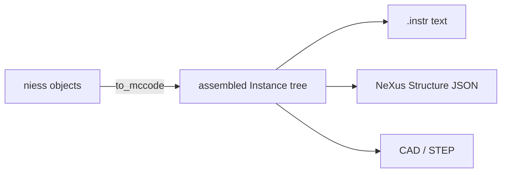

# Core concepts

Five ideas explain most of niess. None of them is large.

## A component is calibration, not geometry

A `Component` holds what was *measured* about a thing — a guide's length and m-values,
a chopper's radius and window — with units attached, as scipp `Variable`s. It knows how
to express itself as a McStas component through one method:

```python
def __mccode__(self) -> tuple[str, dict]:
    return 'Guide_gravity', {'l': self.length.to(unit='m').value, ...}
```

That is the only place units are converted. Everywhere upstream, a length is
`350 * mm` because that is what the drawing says.

## A section is a declaration

A `Section` is an ordered list of typed fields naming the components in beam order.
There is no method to write; the order *is* the information:

```python
class Guides(Section):
    unit_1: StraightGuide
    unit_2: StraightGuide
```

Sections nest. A section without `_flat = True` emits itself as an included
sub-instrument, so the generated McStas mirrors how you think about the beamline
rather than being one flat list.

Fields whose names begin with `_` are per-class extras rather than components — `_flat`
is one — and are ignored by every introspection method, so a section can carry as many
as it needs.

## A calibration is a dictionary

Constructing an instrument means handing it nested plain dictionaries whose keys match
the section field names:

```python
Primary.from_calibration(teaching_parameters())
```

Positions inside those dictionaries are *chained* with `at_relative`, each element
placed against the one before it, which is what a McStas `AT (0, 0, d) RELATIVE
previous` line does — except computed once rather than typed repeatedly. Move something
upstream and everything downstream follows.

`@calibration` lets `from_calibration` accept either one dictionary or keyword
arguments, and `variant_parameters` selects between design variants of a repeated unit.

## Adapters run on the assembled instrument, not on niess objects

This is the design decision that makes everything else work. Converting to McStas
produces an `mccode_antlr` instrument — a flat list of component instances. **Every
other output is generated from that**, not from the niess objects:



Two consequences. Composites dissolve for free: a detector bank that is one niess object
and 45 McStas instances arrives at the adapters already flattened, so no adapter needs
to know what a bank is. And adapters work on instruments niess did not build, because
by that point there is nothing niess-specific left to require.

## Provenance is the breadcrumb back

Flattening loses information — which instance came from which niess object, and what it
was for. So `to_mccode` tags each instance with a small JSON `METADATA` block recording
its source type, source name, role and any extras.

Adapters dispatch on that, most specific first: the niess **source type**, then the
niess **role**, then the raw **McStas component type**. The first two only exist for
niess-built instruments; the third always works. That is how one registry serves both
"this is a niess `EllipticGuide`" and "this is some `Guide_gravity` from a file I have
never seen".

The same mechanism carries per-instance choices the adapters need but McStas has no
concept of, such as [which protocol a monitor streams on](how-to/nexus-structure.md#choosing-how-a-monitor-streams).

!!! warning "Hand-built instances must be tagged"

    `Component.to_mccode` tags what it emits. A composite that calls
    `assembler.component()` itself must call `add_niess_metadata` — otherwise the
    instance is invisible to every adapter, with no error to tell you.
